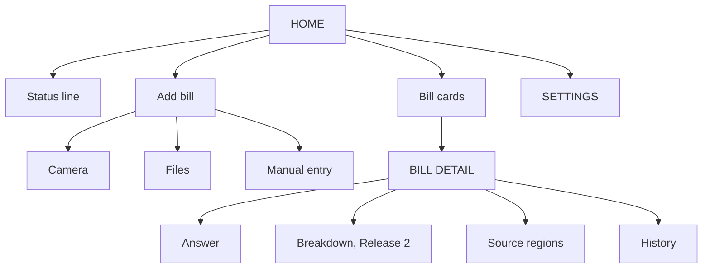
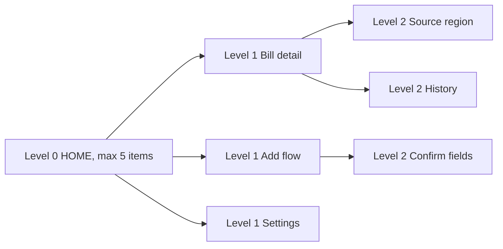
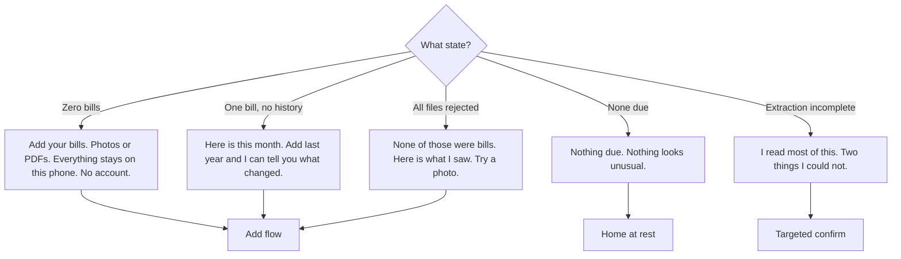
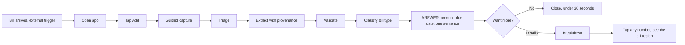
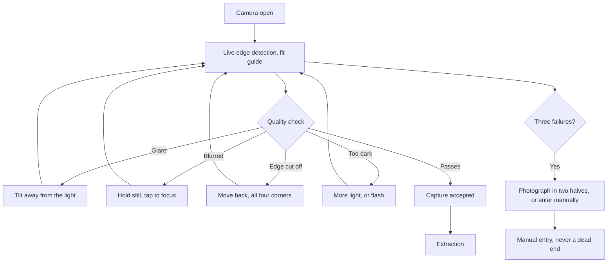
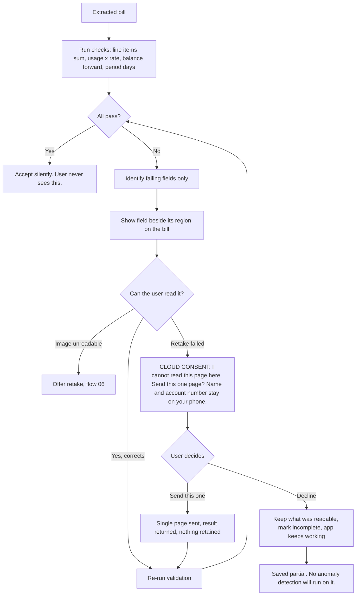
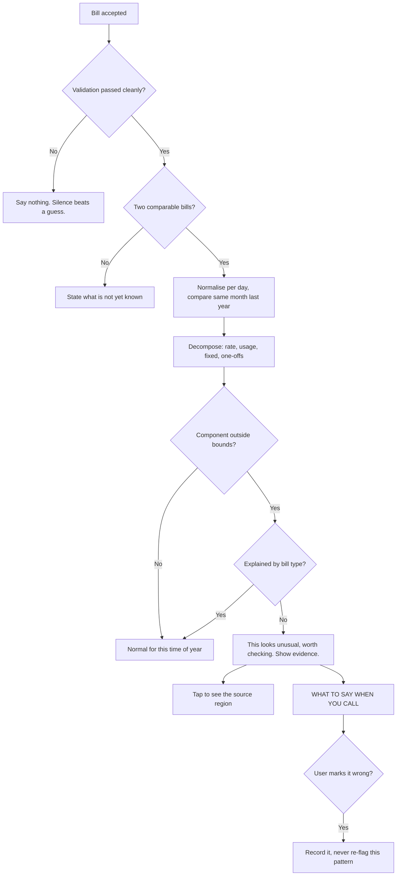
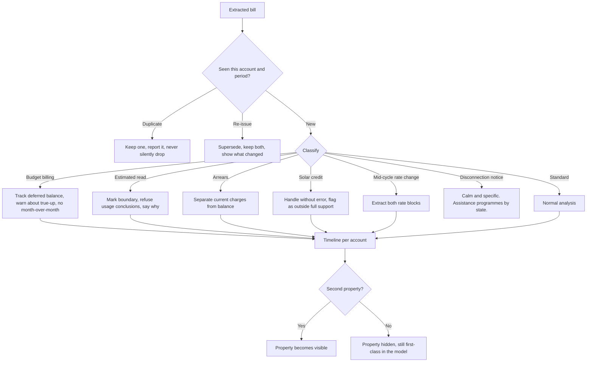

# Home Utility Bill Intelligence
## Product, IA, Flows, Journey and Design System

---

**Version** 1.0 · **Date** 2026-09-17 · **Status** Design guidelines approved for mockups
**Platform** Native iOS first · **Market** United States · **Architecture** Local-first (L2)

**Companion document:** `product-requirements.md` holds the full PRD, 20 user stories, edge case register, MoSCoW and security items. This document is the design authority.

---

# Part 1 — Product

## The one sentence

Take a photo of your utility bill and the app tells you, in one sentence, whether this month is normal and why it changed. Everything stays on your phone.

## The problem

A US household pays four to six utility providers on different cycles, in different formats, through different portals. When a bill jumps thirty dollars, finding out why means comparing this month's per-kWh rate, fixed charges, riders and usage against the same month last year, inside a document written in utility jargon.

That is twenty to forty minutes of work per bill. Almost nobody does it. So rate increases, expired supply contracts, wrong plans and billing errors sit undetected for years.

**The problem is not tracking. Tracking is solved. The problem is that the number arrives with no explanation attached, and the explanation is expensive to produce.**

## Positioning

> We read the bill, not just the amount.

Every competitor shows what you spent. We show why it changed, whether it should have, and what specifically to say when you call.

## Why this is defensible

Green Button, the US industry standard for utility data access, explicitly excludes bill PDFs, demand, line item detail, time-of-use breakdowns and third-party supplier charges. Incumbents with bank and utility integrations structurally cannot see what a photograph reveals.

The hard thing here is not something the big players have and we lack. It is something the standard itself does not carry.

## Scope

| | |
|---|---|
| **Release 1** | Capture, extraction, validation, classification, unified due view, provenance |
| **Release 2** | Change decomposition, anomaly detection |
| **Architecture** | Local-first. On-device extraction. Explicit per-bill cloud consent on failure only. |
| **Account** | None. No signup, no password, no server. |
| **Out of scope v1** | Bill payment, household sharing, tariff marketplace, bank sync, web app |

---

# Part 2 — Users

Four personas. Two are markets, two are design constraints that exist to break the design.

```
  BARRIER                                              DEPTH
  |--------------------------------------------------------|
  Rafael          Marguerite        Dana            Wes
  (constraint)    (constraint)      (volume)        (constraint)
```

### Rafael Ocampo, 61 — maximum barrier

Warehouse night shift. Phone only, storage nearly full. Spanish first language. Electric and gas in his name, water passed through by a landlord with no evidence. On a payment arrangement after falling behind last winter. Targeted by a shutoff scam call, so urgency now reads as threat.

> "Tell me the number I have to pay and the day. Everything else is noise until I know that."

**Breaks:** language, photo-only capture, arrears versus usage, and our entire alert tone.

### Marguerite Oyelaran, 74 — trust and legibility

Retired school administrator, lives alone. iPad daily. Reading glasses. Does not trust anything that asks for a password. Fixed income, so a forty dollar swing is a decision about something else. Keeps paper copies because she does not believe the app will still have them next year.

> "I don't need a chart. I need someone to tell me if I'm alright."

**Breaks:** type size, target size, any sentence needing a glossary, any flow requiring trust in something invisible.

### Dana Whitfield, 43 — the volume user

Operations coordinator, two kids, owns her home. Five utility accounts, four portals, medium tech comfort. Opens the app five times a month for under two minutes. Never browses.

> "I pay them. I don't understand them. I've made peace with that and I hate it."

### Wes Tanaka, 38 — depth and trust

Backend engineer. Two properties, rooftop solar, net metering, runs Home Assistant. Deep session once a quarter, then ignores it. Will evangelise or trash the product in one sentence.

> "If I can't see how you got the number, I assume you got it wrong."

**Breaks:** solar, multi-property, data opacity, export.

### The universal design bet

Marguerite is not a second audience. She is the design constraint. If a target is too small for her, it annoys Dana. If a sentence needs a glossary for her, Dana is skimming past it. Design for Marguerite and Dana gets a better product for free. Design for Dana and Marguerite is locked out.

**There is no accessibility mode. The moment you ship a large text mode you have admitted the default is bad.**

---

# Part 3 — Journey

## Current state, as-is

| # | Stage | What happens | Feeling | Cost |
|---|---|---|---|---|
| 1 | Bill arrives | Email among forty, or paper in a stack. Five providers, five days. | Background static | Noticed late or not at all |
| 2 | Triage | Decide whether this needs attention. Answer is almost always "later." | Mild avoidance | Due dates get close |
| 3 | Open it | Log in, reset password, find the PDF | Friction, resentment | Large share of attempts stop here |
| 4 | Look at the number | Eyes go to the total. Nothing else is read. | Relief or dread | Every line item invisible |
| 5 | React | Form a theory instantly: "it was cold" | Rationalisation | The theory is never checked |
| 6 | Decide to investigate | Cost is 20 to 40 minutes, payoff unknown. Almost nobody does. | Resignation | Errors persist for years |
| 7 | Pay | Autopay or portal | Task closed | Paying removes the prompt to understand |
| 8 | Forget | No unified record | Neutral | Next month starts from zero |

## The three structural traps

**Stage 5 is where the product lives.** The user forms an explanation that satisfies them enough to stop. They are not lazy. They are behaving correctly given a forty minute verification cost with unknown payoff. Our job is to make verification cost zero, which flips the calculation.

**Stage 7 destroys stage 6.** Autopay is sold as convenience and is also why nobody catches anything. Compete with autopay and you lose. Sit before it and take ten seconds and you win.

**Stage 8 is why nothing compounds.** No baseline means every month is judged against vague memory. Cheapest problem to solve, and it unlocks stage 5.

## Target state

| Stage | As-is | To-be |
|---|---|---|
| Arrival | Scattered across five channels | Same trigger, one destination |
| Open | Login friction | Ten second photo |
| Read | Total only | Total, plus one sentence of meaning |
| React | Unchecked theory | Verified decomposition |
| Investigate | 20 to 40 minutes, skipped | Zero effort, automatic |
| Close | Paid and forgotten | Answered, and the baseline improved |

---

# Part 4 — Behavioural Model

## The Hook Model, partially rejected

The Hook Model's own frequency matrix places low-frequency, high-value products in the "viable product" box, **not** the habit zone. Bills arrive monthly. You cannot manufacture a daily habit around a monthly event without manufacturing fake reasons to open the app.

More seriously: the available internal trigger here is financial anxiety, and the available variable reward is "maybe your bill is wrong this time." Roughly one in six US households entered 2026 behind on utility payments. Building that loop produces an anxiety slot machine aimed at people in financial stress. On the Manipulation Matrix that is a Dealer, not a Facilitator.

**Adherence score: 3/10, deliberately. This gap is a design position, not a defect.**

### Rejected outright

- Streaks, badges, progress bars toward nothing
- Variable rewards of any kind
- Engagement notifications ("you haven't checked in a while")
- Urgency, countdowns, FOMO copy
- Any metric that rewards more time in app

### Adopted

**Trigger.** The bill arriving is the external trigger. It already exists in the user's life with perfect timing, so we never generate our own. The internal trigger we serve is *uncertainty*, specifically the "is this right?" feeling at stage 4. That is legitimate to resolve because resolving it ends the loop rather than extending it.

> The best notification is the one telling you nothing is wrong, so you don't open the app.

**Investment.** Every bill added improves the baseline for every future bill. Month one the product is guessing. Month twelve it knows your house. Batch onboarding front-loads twelve months of stored value before first use — most products spend a year accumulating what we get in ninety seconds.

**Reward, reframed.** Not variable. The reward is resolution: consistent, fast, boring.

**The one mechanic worth building:** a completion signal at the end of onboarding showing what the product now knows. *"You've added 12 bills. I can now compare any month against the same month last year."* Investment made visible, honestly, with no manipulation.

---

# Part 5 — Information Architecture

```
HOME  ← the only destination that matters
│
├── Status line          "Nothing due. Nothing unusual."
├── Bill cards           one per provider, ordered by due date
└── Add bill             persistent, primary action
     ├── Camera          guided capture
     ├── Files           single or batch
     └── Manual entry

BILL DETAIL  ← reached only by tapping a bill card
├── Answer               amount, due date, one sentence
├── Breakdown            decomposition                [Release 2]
├── Source               tap any number → region on the bill
└── History              this account over time

SETTINGS  ← four items, stays four
├── Backup & restore
├── Language
├── Reminders
└── Detail level         one sentence / with reasons / full data
```

## The four structural decisions

**No analytics or insights section.** Insight lives on the bill it came from, never in a separate tab. A separate section is a place you have to remember to visit, and Dana never will. It also breaks provenance, because a chart divorced from its source document is exactly the untraceable number Wes refuses to trust.

**No tab bar.** Home plus a persistent Add button. Hick's Law at the top level: two choices, not five. This is a deliberate deviation from HIG, documented in Part 6.

**Accounts and properties invisible until there are two.** Property is a first-class object in the data model because Wes forces it, but a single-property user never sees the concept.

**Settings is four items and stays four.** Every settings screen starts at four. The discipline is refusing the fifth.

## Content hierarchy on Home

Five items maximum, Miller's Law, in priority order:

1. Is anything due, and when
2. Is anything unusual
3. The bills themselves
4. Add
5. Nothing else

## Navigation constants

| Constraint | Value | Source |
|---|---|---|
| Top-level choices | 2 | Hick's Law |
| Maximum depth from Home | 3 taps | — |
| Items per screen | 5 | Miller's Law |
| Capture to answer, median | 30s | Doherty Threshold |

---

# Part 6 — Design System

## Foundation: Apple HIG, with four documented deviations

We follow Apple's Human Interface Guidelines as the base, because Jakob's Law says people have thirty years of mental models and we should borrow rather than invent. Four places where our product requirements override HIG defaults, each deliberate:

| # | HIG default | Our rule | Why |
|---|---|---|---|
| **D1** | 44×44pt minimum touch target | **60×60pt minimum** | 44 is a floor, not a target. Marguerite's reading glasses and Rafael's cracked screen set the bar. Apple itself uses 60pt on visionOS, so there is precedent. Exceeding a minimum is not a violation. |
| **D2** | System red for alerts and warnings | **Red only for destructive confirmation.** Never for bill status. | Rafael has been targeted by shutoff scams. Alarm styling from us is indistinguishable from fraud to him. Bill status is carried in words, never colour. |
| **D3** | Tab bar for top-level navigation | **No tab bar.** Home plus persistent Add. | Hick's Law. Five tabs is five decisions on every launch for a product with two real destinations. |
| **D4** | 17pt body text | **19pt body text**, with full Dynamic Type support | 17 is correct for a general app. This one gets read once, slowly, by someone in reading glasses. Dynamic Type is Apple's native answer to accessibility without a bolt-on mode, which is exactly the universal design position. |

## The four HIG pillars, applied here

**Clarity.** Every element has a purpose. For this product that means: if a screen element does not help answer "am I alright," it is removed.

**Deference.** UI supports content, never competes. Here the content *is* the money. Minimal chrome, near-zero brand colour, neutral surfaces. The dollar amount is the hero of every screen.

**Depth.** Layers carry hierarchy. Used sparingly: one elevation level for cards, one for modals. No decorative depth.

**Consistency.** Native iOS patterns throughout. Standard sheet presentation, standard swipe-back, standard Dynamic Type. The only novel interaction in the product is tap-a-number-to-see-its-source, and that is novel because nothing else does it.

## No glass, no blur

Minimal design was the explicit brief. Solid backgrounds throughout. Translucency costs legibility, and legibility is the whole product for two of our four personas.

---

## Typography

**Family:** SF Pro. Display at ≥20pt, Text below 20pt. System stack, no custom font, no download.

```css
--font-system: -apple-system, BlinkMacSystemFont, 'SF Pro Display',
               'SF Pro Text', 'Helvetica Neue', sans-serif;
--font-mono: 'SF Mono', SFMono-Regular, Menlo, monospace;
```

### Scale

| Token | Size | Weight | Use |
|---|---|---|---|
| `--text-amount` | 44pt | Semibold | The dollar amount. The largest thing on any screen, always. |
| `--text-large-title` | 34pt | Bold | Onboarding headline only |
| `--text-title1` | 28pt | Semibold | Screen titles |
| `--text-title3` | 20pt | Semibold | Section headers, provider names |
| `--text-headline` | 19pt | Semibold | Emphasised body, the one sentence |
| `--text-body` | 19pt | Regular | **Default.** All running text. |
| `--text-subhead` | 17pt | Regular | Secondary detail |
| `--text-footnote` | 15pt | Regular | Dates, metadata |
| `--text-caption` | 13pt | Regular | Provenance labels. Floor — nothing smaller ships. |

**Line height:** 1.4 for body, 1.2 for anything ≥28pt.

### Typography rules

1. **The amount is always the largest element on screen.** No exceptions, including anomaly screens.
2. **Hierarchy through weight before size.** Three sizes on a screen is the ceiling.
3. **Dynamic Type is mandatory, not optional.** Every screen must survive at the largest accessibility size without truncation or horizontal scroll.
4. **13pt is the floor.** If content needs to be smaller to fit, the content is wrong.
5. **Tabular figures for all currency.** `font-variant-numeric: tabular-nums`. Amounts must align vertically in lists.

---

## Colour

Near-zero brand colour. Deference pillar: the money is the content.

### Semantic tokens

```css
/* Light */
--label-primary:    #000000;
--label-secondary:  rgba(60, 60, 67, 0.6);
--label-tertiary:   rgba(60, 60, 67, 0.3);
--bg-primary:       #FFFFFF;
--bg-secondary:     #F2F2F7;
--bg-grouped:       #F2F2F7;
--separator:        rgba(60, 60, 67, 0.29);
--action:           #007AFF;   /* system blue, interactive only */
--destructive:      #FF3B30;   /* delete confirmation ONLY */

/* Dark */
--label-primary:    #FFFFFF;
--label-secondary:  rgba(235, 235, 245, 0.6);
--label-tertiary:   rgba(235, 235, 245, 0.3);
--bg-primary:       #000000;
--bg-secondary:     #1C1C1E;
--bg-grouped:       #000000;
--separator:        rgba(84, 84, 88, 0.6);
--action:           #0A84FF;
--destructive:      #FF453A;
```

### Colour rules

1. **Colour never carries bill status.** Not green for fine, not red for problem, not amber for attention. Words carry status. A colourblind user, a user in bright sun, and a user who distrusts alarm styling all get the same information.
2. **System blue means tappable.** Nothing else is blue. Jakob's Law: thirty years of iOS training.
3. **Red appears exactly once in the product:** the confirm button on delete. Never on a bill, never on a due date, never on an anomaly.
4. **No brand colour on functional screens.** Brand expression lives in the app icon and the onboarding screen. After that it gets out of the way.
5. **Contrast floor is WCAG AA, 4.5:1 for body text.** Verified in both schemes at all Dynamic Type sizes.

---

## Spacing

8pt grid.

```css
--space-1:  4px;    --space-2:  8px;
--space-3:  12px;   --space-4:  16px;
--space-5:  20px;   --space-6:  24px;
--space-8:  32px;   --space-10: 40px;
--space-12: 48px;   --space-16: 64px;
```

| Context | Value |
|---|---|
| Screen edge margin | 20px |
| Between cards | 12px |
| Card internal padding | 20px |
| Between list rows | 0, separator only |
| Above a primary button | 32px |
| Minimum between tappable elements | 12px |

---

## Radius

Concentric rule: `inner + padding = outer`.

```css
--radius-sm:   8px;    /* nested elements */
--radius-md:   12px;   /* inputs, small controls */
--radius-lg:   16px;   /* bill cards */
--radius-xl:   20px;   /* sheets, modals */
--radius-full: 9999px; /* primary buttons, capsule */
```

Example: a 16px bill card containing an 8px inner element needs 8px padding between them.

---

## Components

### Bill card — the signature component

The single most important component in the product. Appears on Home, one per provider.

```
┌────────────────────────────────────────┐
│                                        │
│  Ohio Edison                     15pt  │
│                                        │
│  $148.20                         44pt  │
│  Due March 22                    17pt  │
│                                        │
│  Normal for this time of year.   19pt  │
│                                        │
└────────────────────────────────────────┘
```

**Rules**
- Minimum height 120px. Entire card is the tap target, far above the 60pt floor.
- Amount is always the largest element.
- Exactly one sentence of interpretation. Never two.
- No chevron, no icon, no colour coding, no progress indicator.
- Background `--bg-primary`, radius `--radius-lg`, single hairline separator between cards. No shadow.

### Buttons

| Variant | Use | Spec |
|---|---|---|
| **Primary** | One per screen, maximum | Capsule, `--action` fill, white 19pt semibold, min-height 60px, padding 16×32 |
| **Secondary** | Alternative action | Capsule, `--action` at 10% opacity, `--action` text, same dimensions |
| **Plain** | Tertiary, dismissals | Text only in `--action`, min 60px tap area |
| **Destructive** | Delete confirmation only | `--destructive` text on plain background. Never a filled red button. |

**Labels are verbs.** "Add bill", "Take photo", "Send this page". Never "Submit", "Continue", "OK".

**Press feedback:** `scale(0.97)`, 100ms, `--ease-out`.

### List rows

- Minimum height 60px, above HIG's 44
- Chevron for navigation, nothing for information
- Separators inset to 60px when there is leading content
- Grouped style, `--radius-lg`, 20px side margins

### Input fields

- Minimum height 60px
- `--bg-secondary` fill, no border, `--radius-md`
- 19pt text
- Focus ring: 4px `--action` at 30%
- Numeric fields use the number pad, always

### Sheets

Standard iOS sheet. Detents at medium and large. Grabber visible. Swipe to dismiss always available, because Marguerite needs a way out that does not require finding a button.

---

## Motion

```css
--duration-instant: 100ms;  /* press feedback */
--duration-fast:    200ms;  /* state change */
--duration-normal:  300ms;  /* navigation */
--ease-default:     cubic-bezier(0.25, 0.1, 0.25, 1);
--ease-out:         cubic-bezier(0, 0, 0.58, 1);
--ease-spring:      cubic-bezier(0.175, 0.885, 0.32, 1.275);
```

### Motion rules

1. **Motion explains, never decorates.** If a movement does not show where something came from or went, remove it.
2. **Processing shows real progress, never an indeterminate spinner.** During batch, provider names appear as each file is identified. The user watches it work.
3. **No celebration animation.** No confetti when a bill is added. This is somebody's electricity bill.
4. **`prefers-reduced-motion` honoured absolutely.** All transitions to 0.01ms.
5. **Under 30 seconds, no progress UI needed. Over 5 seconds, progress UI required.** Doherty Threshold.

---

## Voice and copy

The most under-specified part of most design systems, and the most important part of this one. Copy is where this product either earns trust or reads like a scam.

### The five copy rules

**1. State the fact, then the meaning. Never the other way round.**

| Do | Don't |
|---|---|
| "$148.20, due March 22. Normal for this time of year." | "Good news! Your bill looks totally normal this month." |

**2. Never assert an error. Always invite a check.**

| Do | Don't |
|---|---|
| "This rider is new this month and is not on your plan. Worth checking." | "You've been overcharged $4." |
| "I couldn't match this charge to anything on your plan." | "Billing error detected." |

**3. No urgency. Ever. Including on disconnection notices.**

| Do | Don't |
|---|---|
| "This notice says service may be interrupted after March 30. Here are the assistance programmes in Ohio." | "⚠️ URGENT: Shutoff in 3 days! Act now!" |

**4. Never lecture, never judge.**

| Do | Don't |
|---|---|
| "You used more than last March." | "Your usage is above average. Consider lowering your thermostat." |
| "This is the highest bill in the twelve months I have." | "You should really do something about this." |

**5. Say what you don't know, plainly.**

| Do | Don't |
|---|---|
| "I only have one bill for this account, so I can't tell you what changed yet." | "Insufficient data available." |
| "The meter reading on this one was estimated, so I'm not going to guess at usage." | *(silently comparing anyway)* |

### Reading level

Target 6th grade for all interface copy. Every utility term gets translated on first use or is not used. If a sentence needs a glossary, it is the wrong sentence.

| Utility term | What we say |
|---|---|
| Distribution charge | What they charge to deliver it |
| Supply charge | What the electricity itself costs |
| Rider | An extra charge added to your rate |
| Estimated read | They guessed instead of reading the meter |
| True-up | The yearly settling-up |
| Tariff | Your rate plan |

### Language

Interface language is independent of bill language. Extraction is language-agnostic. Spanish at launch alongside English, because Rafael is a named persona and not a nice-to-have.

---

## Accessibility

Not a section. A constraint that already produced D1 and D4.

| Requirement | Standard |
|---|---|
| Touch targets | 60×60pt minimum |
| Contrast | WCAG AA, 4.5:1 body, verified both schemes |
| Dynamic Type | All sizes including accessibility sizes, no truncation, no horizontal scroll |
| VoiceOver | Every element labelled. Amounts read as currency, not digits. |
| Reduced motion | Honoured absolutely |
| Colour independence | No information carried by colour alone, anywhere |
| One-handed use | Every primary action reachable in the bottom third |

---

## Anti-patterns

Explicitly forbidden in this product.

| Pattern | Why |
|---|---|
| Streaks, badges, gamification | Hook rejection. Monthly product, vulnerable users. |
| Engagement notifications | We notify about bills, never about the app. |
| Red or amber for bill status | D2. Indistinguishable from scam styling. |
| Countdown timers | Manufactured urgency on somebody's utility bill. |
| A dashboard as a destination | Peak-End. Flows end on answers, not charts. |
| Generic efficiency tips | "Lower your thermostat" is not insight. |
| Asserting an error | Liability, and one false positive costs permanent trust. |
| Onboarding carousels | Three screens of promises before any value. |
| Asking for an account | The entire local-first advantage. |
| Glass, blur, decorative gradients | Minimal brief. Legibility is the product. |
| Celebration animations | Somebody's electricity bill. |
| Hiding the arithmetic | Wes's single stated condition for trust. |

---

# Part 7 — User Flows

Ten flows. Mermaid source is directly usable in Figma's `generate_diagram`.

## Flow 01 — IA site map



## Flow 02 — Navigation depth



## Flow 03 — First run, batch onboarding

```mermaid
flowchart LR
  A["Open app first time"] --> B["One screen: what it does, nothing leaves this phone, no account"]
  B --> C{"Choose input"}
  C --"Files"--> D["Select any number of bills"]
  C --"Camera"--> E["Guided capture"]
  D --> F["Per-file triage, provider appears as identified"]
  E --> F
  F --> G{"Is it a bill?"}
  G --"No"--> H["Set aside with plain reason, batch continues"]
  G --"Yes"--> I["Extract with confidence per field"]
  I --> J["Arithmetic self-validation"]
  J --> K{"Does the math close?"}
  K --"Yes"--> M["Accepted silently"]
  K --"No"--> L["Targeted confirm, flow 07"]
  L --> M
  H --> N
  M --> N["Timeline built per account"]
  N --> O["Completion: 12 bills added, I can now compare any month against the same month last year"]
  O --> P["HOME"]
```



## Flow 04 — Empty and first-run states



## Flow 05 — Monthly single bill, happy path



## Flow 06 — Capture quality and retake



## Flow 07 — Validation failure, confirm, cloud consent

**The most important flow in the product.** Local-first, the L2 consent promise and extraction accuracy all collide here.



## Flow 08 — Anomaly, evidence, phone script



## Flow 09 — Bill-type branching



## Flow 10 — Data lifecycle

```mermaid
stateDiagram-v2
  [*] --> FirstRun
  FirstRun --> Active : bills added
  Active --> BackupPrompt : after 3rd bill
  BackupPrompt --> BackedUp : user chooses location
  BackupPrompt --> Active : declined, reminded later
  BackedUp --> Active : automatic from here
  Active --> Exported : CSV or JSON
  Exported --> Active : app unchanged
  Active --> Deleted : user deletes a bill
  Deleted --> Active : provenance retained
  Active --> DeviceLost
  DeviceLost --> Restoring : new device, no account needed
  Restoring --> Active : history, images, provenance all back
  DeviceLost --> [*] : no backup existed
```



---

# Part 8 — Task Coverage

| Task | Description | Flows |
|---|---|---|
| T1 | Work out what this is and whether to trust it | 03, 04 |
| T2 | Add the first stack of bills | 03 |
| T3 | Resolve extraction failures in a batch | 03, 06, 07 |
| T4 | Understand what the app now knows | 03 |
| T5 | Check whether anything is due | 01, 02, 05 |
| T6 | Check whether anything looks unusual | 01, 08 |
| T7 | Add one bill by photo | 05, 06 |
| T8 | Add one bill from a file | 03, 05 |
| T9 | Add a bill manually | 04, 06 |
| T10 | Retake a bad photo | 06 |
| T11 | Confirm a field that failed validation | 07 |
| T12 | Decide on cloud fallback | 07 |
| T13 | Read the answer for one bill | 01, 02, 05 |
| T14 | See why a bill changed | 08 |
| T15 | Verify a number against its source | 02, 05, 08 |
| T16 | Get the phone script for an anomaly | 08 |
| T17 | See history for one account | 01 |
| T18 | Correct a wrong extraction later | 07 |
| T19 | Handle a duplicate upload | 09 |
| T20 | Handle a re-issued bill | 09 |
| T21 | Delete a bill | 10 |
| T22 | Back up | 10 |
| T23 | Restore on a new device | 10 |
| T24 | Export | 10 |
| T25 | Change detail level | 01 |
| T26 | Change language | 01 |
| T27 | Set or silence reminders | 01 |
| T28 | Add a second property | 09 |
| T29 | Handle a non-bill file or scam letter | 03, 04 |
| T30 | Handle a disconnection notice | 09 |

---

# Part 9 — Design Rules Summary

Pin this to the wall.

| Rule | Value | Source |
|---|---|---|
| Minimum touch target | 60×60pt | Fitts's Law, D1 |
| Body text | 19pt, Dynamic Type mandatory | D4 |
| Smallest text that ships | 13pt | — |
| Maximum items per screen | 5 | Miller's Law |
| Top-level choices | 2 | Hick's Law, D3 |
| Maximum depth | 3 taps | — |
| Capture to answer | under 30s median | Doherty Threshold |
| Primary buttons per screen | 1 | — |
| Settings items | 4 | — |
| Urgency signals | 0 | D2 |
| Streaks, badges, variable rewards | 0 | Hook rejection |
| Reading level | 6th grade | — |
| Information carried by colour alone | none | Accessibility |
| Every flow ends on | an answer, never a dashboard | Peak-End Rule |
| Visual language borrowed from | bank statement, text message | Jakob's Law |
| The largest element on any screen | the amount | Deference |

---

# Part 10 — Handoff

## Complete

- Product definition, positioning, defensibility
- 4 personas, 2 as markets, 2 as constraints
- As-is journey, 8 stages, 3 structural traps, to-be mapping
- Behavioural model with documented Hook rejection
- Information architecture, 4 structural decisions
- Design system: HIG base, 4 documented deviations, tokens, components, motion, voice
- 10 user flows covering 30 tasks
- Anti-pattern register

## Next

**Mockups.** Priority order: Home at rest, bill card states, the answer screen in three registers, flow 07's consent prompt, the five empty states.

**Agent 3, System Architect.** On-device model selection, data model with property as a first-class object, the validation engine, encrypted backup key handling, cloud fallback contract. Seven security items are logged in `product-requirements.md`.

## Open

| Question | Owner |
|---|---|
| iOS first or both platforms | Owner |
| Does register switching adapt automatically or is it a setting | Designer |
| Which 20 utility formats define the accuracy target | Owner |
| Cloud fallback provider and retention policy | Architect |
| Path back to household sharing in v2 | Owner |
| Backup prompt after third bill — placement not yet approved | Owner |
