# Context Graph Overview

> Auto-generated from the project source docs.
> Re-generate with: `python context-graph/build.py`

## The product

> Take a photo of your utility bill and the app tells you, in one sentence,
> whether this month is normal and why it changed.

## Architecture pivot (v1 → v2)

| Founding decision | v1 (original) | v2 (pivot) |
|---|---|---|
| Architecture | Local-first, on-device | Supabase cloud + local processing |
| Platform | Native iOS only | Flutter: Web + iOS + Android |
| Account | None, no signup | OAuth (Google + Apple), bypass flag in v1 |
| AI/OCR | Apple on-device Foundation Models | Python FastAPI microservice |

## Post-pivot additions

Additions made after the pivot, tracked in the vault (not auto-parsed from the
source requirements):

- **M14: Manual quick entry** — realises the manual-entry half of Decision D3
  ("manual entry plus photo/PDF capture"). Add a bill in seconds with just a
  name + amount; the category icon auto-detects from the name.
- **Category Icon Auto-Detection** — one deterministic keyword->icon resolver
  shared across bill cards, manual entry, and expense rows.
- **M15: Edit and delete entries** — every entry (captured bill, manual bill,
  group expense, settlement) is correctable and removable, with confirm+Undo,
  optimistic rollback, and no silent balance changes. See
  `vault/Code-Practices/Edit-Delete-Edge-Cases.md` for the full failure surface.
  Shipped for bills in Release 1: swipe-to-delete + detail delete (both with a
  5s Undo) and edit via the prefilled manual form.
- **M16: Billing-only interface** — the redesign that hides SplitWise from
  navigation (code kept, unlinked) and refocuses on three tabs (Bills / Insights
  / Settings) with a bill-type filter, per-type tracking graphs, easy add/remove,
  and full responsiveness. Grounded in the daisyUI component vocabulary and the
  dark sky/indigo + Newsreader theme.

## Relationship map

The diagram below shows the most important connections.
Open the `vault/` folder in Obsidian for the full interactive graph.

```mermaid
graph TD
  subgraph Version [Version]
    ver_1_0["v1.0 — Local-first iOS"]
    ver_2_0["v2.0 — Cloud / Multi-platform"]
  end
  subgraph Persona [Persona]
    persona_wes["Wes Tanaka"]
    persona_marguerite["Marguerite Oyelaran"]
    persona_rafael["Rafael Ocampo"]
    persona_dana["Dana Whitfield"]
  end
  subgraph Feature [Feature]
    feat_m11["M11: Per-bill cloud consent"]
    feat_m4["M4: Extraction with confidence and prove"]
    feat_m8["M8: Unified due view"]
    feat_m5["M5: Arithmetic self-validation"]
    feat_m13["M13: Anomaly flagging (R2)"]
    feat_m12["M12: Change decomposition (R2)"]
    feat_m3["M3: Guided capture UI"]
    feat_m1["M1: Batch multi-file drop"]
    feat_m9["M9: Provenance and audit trail"]
  end
  subgraph UXLaw [UXLaw]
    ux_hick["Hick's Law"]
    ux_miller["Miller's Law"]
    ux_tesler["Tesler's Law"]
    ux_fitts["Fitts's Law"]
    ux_peak_end["Peak-End Rule"]
  end
  subgraph Deviation [Deviation]
    dev_d1["HIG Deviation D1"]
    dev_d3["HIG Deviation D3"]
    dev_d2["HIG Deviation D2"]
    dev_d4["HIG Deviation D4"]
  end
  subgraph TechComponent [TechComponent]
    tc_fastapi["Python FastAPI"]
    tc_supabase["Supabase"]
    tc_oauth["OAuth 2.0"]
    tc_flutter["Flutter"]
  end
  subgraph CodePractice [CodePractice]
    cp_no_model_math["No Model Arithmetic"]
    cp_fe_be_sep["Frontend / Backend separation"]
    cp_python_ai["Python for AI + Graphs"]
    cp_provenance["Provenance by default"]
  end
  subgraph PipelineStage [PipelineStage]
    pipe_0["Stage 0: Triage"]
    pipe_3["Stage 3: Classification"]
    pipe_6["Stage 6: Narration"]
    pipe_5["Stage 5: Analysis"]
    pipe_1["Stage 1: Extraction"]
    pipe_2["Stage 2: Self-validation"]
  end
  subgraph SecurityItem [SecurityItem]
    sec_sec_pm_002["SEC-PM-002"]
    sec_sec_pm_007["SEC-PM-007"]
    sec_sec_pm_001["SEC-PM-001"]
  end
  ver_2_0 -->|supersedes| ver_1_0
  dev_d1 -->|justifies| ux_fitts
  dev_d3 -->|justifies| ux_hick
  dev_d4 -->|justifies| ux_miller
  feat_m1 -->|applies to| persona_dana
  feat_m1 -->|applies to| persona_wes
  feat_m1 -->|justifies| ux_miller
  feat_m3 -->|applies to| persona_rafael
  feat_m3 -->|justifies| ux_fitts
  feat_m4 -->|applies to| persona_wes
  feat_m5 -->|applies to| persona_dana
  feat_m5 -->|justifies| ux_tesler
  feat_m8 -->|applies to| persona_marguerite
  feat_m8 -->|applies to| persona_dana
  feat_m8 -->|justifies| ux_miller
  feat_m9 -->|applies to| persona_wes
  feat_m11 -->|applies to| persona_marguerite
  feat_m11 -->|applies to| persona_wes
  feat_m12 -->|applies to| persona_dana
  feat_m12 -->|applies to| persona_wes
  feat_m12 -->|justifies| ux_peak_end
  feat_m13 -->|applies to| persona_dana
  feat_m13 -->|justifies| ux_peak_end
  pipe_0 --> pipe_1
  pipe_1 --> pipe_2
  pipe_2 --> pipe_3
  pipe_5 --> pipe_6
  pipe_2 -->|implements| feat_m5
  pipe_1 -->|implements| feat_m4
  pipe_5 -->|implements| feat_m12
  sec_sec_pm_001 -->|constrains| feat_m4
  sec_sec_pm_002 -->|constrains| feat_m11
  tc_flutter --> tc_supabase
  tc_flutter --> tc_fastapi
  tc_fastapi --> tc_supabase
  tc_oauth --> tc_supabase
  cp_fe_be_sep -->|constrains| tc_flutter
  cp_fe_be_sep -->|constrains| tc_supabase
  cp_fe_be_sep -->|constrains| tc_fastapi
  cp_python_ai -->|justifies| tc_fastapi
  cp_no_model_math -->|constrains| pipe_2
  cp_provenance -->|implements| feat_m9
  ver_2_0 -->|justifies| tc_flutter
  ver_2_0 -->|justifies| tc_supabase
  ver_2_0 -->|justifies| tc_fastapi
```

## Entity counts

| Entity type | Count |
|---|---|
| CodePractice | 8 |
| Decision | 10 |
| Deviation | 4 |
| Feature | 27 |
| Flow | 10 |
| Persona | 4 |
| PipelineStage | 8 |
| SecurityItem | 7 |
| TechComponent | 7 |
| UXLaw | 8 |
| UserStory | 20 |
| Version | 2 |
| **Total edges** | **114** |

## Key relationships at a glance

| Relationship | What it means |
|---|---|
| `supersedes` | A newer version or decision replaces an older one |
| `justifies` | A UX law or decision explains why a feature or rule exists |
| `constrains` | A security item or code practice limits a feature or tech component |
| `implements` | A user story or pipeline stage delivers a feature |
| `appliesTo` | A feature serves a persona |
| `dependsOn` | A user story needs another story to exist first |
| `mappedToFlow` | A flow covers a set of user stories |
| `linkedTo` | Two tech components communicate, or pipeline stages are in sequence |
