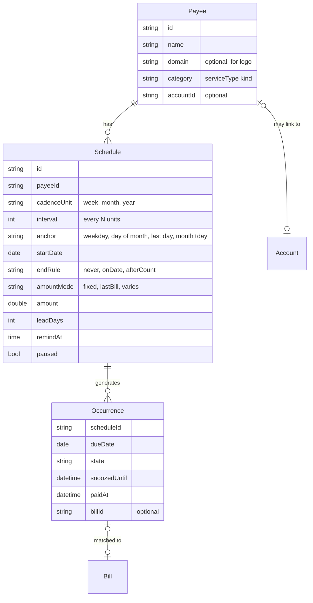
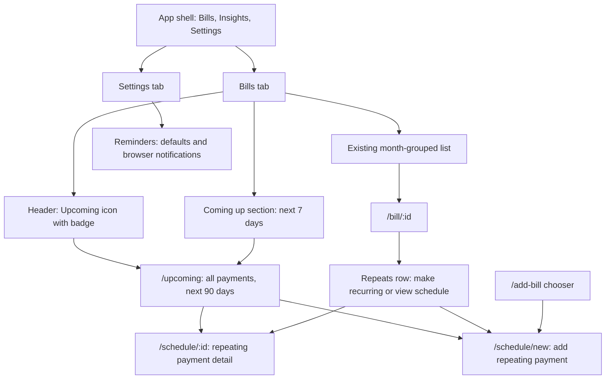

# 02 Define: brief, information architecture, metrics

Skills: `design-brief`, `information-architecture`, `metrics-definition`.

The plan's three open questions were not answered before execution, so this stage decides them explicitly. Each can be reversed cheaply until the handoff is built.

| Open question | Decision for v1 | Why |
| --- | --- | --- |
| Where does a reminder fire? | In-app (Coming up section and a badge) is the source of truth, plus browser notifications while BillSense is open or when it next opens. Email and push are deferred. | The app is Flutter web with no push backend. A browser notification without a service worker only fires from an open tab, so promising more would break J1. |
| Schedule per account or per bill? | Per payee. A schedule belongs to a payee, which is either an existing `Account` or a free-standing payee (rent, insurance) with no account. Bills and reminders are both occurrences of that schedule. | A bill is one cycle; the cadence is a property of the relationship with the payee. Per-bill reminders would have to be re-created every cycle. |
| Keyed or keyless logo API? | Keyless by default (unavatar.io), with an optional Logo.dev publishable token as an upgrade. | No secret or quota to manage in a public Vercel deploy; see the logo evaluation in 04. |

## Design brief

**Project.** Payment Reminders for BillSense. Let people schedule reminders for any recurring payment (weekly, monthly, quarterly, yearly, custom) and see every upcoming payment in one place, each shown with the payee's logo.

**Problem.** BillSense knows about bills after they arrive. It cannot warn about a payment before the bill exists, cannot track payments that never produce a scanned bill (rent, insurance, gym), and has one global reminder setting (Off / Day before / Day of) that is wrong for a yearly insurance renewal and noisy for a weekly payment. Consequence: late fees and service interruptions the app could have prevented (J1), and no forward view of cash going out (J2).

**Audience.** Primary: the single household bill-payer already using BillSense on a phone browser. Secondary: someone adding BillSense only to track subscriptions and rent (no scanned bills).

**Goals.**
1. A user can schedule a recurring payment in under 30 seconds with at most three decisions (payee, cadence, lead time), with everything else defaulted.
2. Every upcoming payment in the next 30 days is visible from the Bills tab without navigating away.
3. A reminder can be resolved (paid, snoozed, skipped) in one tap from where it appears.
4. Payees are recognisable by logo, with a graceful fallback that never shows a broken image.

**Non-goals for v1.** Paying from the app. Autopay detection. Email, SMS, or native push. Shared household reminders. Predicting variable amounts beyond "last amount" (the "recurring bills" reframing from the plan's options is deferred).

**Constraints.**
- Flutter web, CanvasKit renderer: network images need CORS or the HTML-element fallback.
- Offline demo mode (`FakeBillRepository`) must work fully, including logos degrading to monograms when offline.
- Must respect the compact type scale and tokens already in `theme/tokens.dart` and the `< 400pt` compact breakpoint.
- The existing global setting in `settings_state.dart` must not silently change behaviour for existing users.

**Relationship to the existing global setting.** The global Reminders setting becomes the default for new schedules, not a separate system. Migration: `off` maps to "Default reminder: Off" (schedules can still opt in individually), `day_before` to "1 day before", `day_of` to "On the due date". Bills without a schedule keep today's behaviour driven by this default.

**Deliverables.** Concepts (03), prototype package (04), evaluation (05), handoff and QA checklist (06).

## Information architecture

### Content model

Rules:
- Occurrences are computed from the schedule, never stored ahead of time, except when the user acts on one (paid, snoozed, skipped, matched to a bill). Only those overrides are persisted.
- When a bill for the same account arrives within the occurrence's window (due date plus or minus 5 days), the occurrence links to it and takes its amount and paid state. The home list must never show the same payment twice.
- `Payee` is a thin layer: for existing accounts it is derived from `Account.provider` and `Account.serviceType`, so no data migration is needed.

### Labels (user vocabulary, not internal terms)

| Internal | User-facing |
| --- | --- |
| Schedule | Repeating payment |
| Occurrence | Payment (in lists), reminder (in notifications) |
| Lead days | Remind me |
| Cadence | Repeats |
| Payee | Paid to |

"Reminders" stays as the Settings row label because that is where users already look.

### Sitemap

Navigation decisions:
- No fourth tab. Upcoming is reached from the Bills tab (section plus header icon) because J2 happens while looking at bills. A fourth tab would split one mental space in two.
- `/add-bill` gains a third option, "Repeating payment", next to Scan and Enter manually, so the add entry point stays single.
- Depth: every reminder surface is at most two taps from the Bills tab.

## Metrics

HEART categories, 4 primary metrics plus one guardrail. Baselines are measured for 4 weeks before launch where the data exists.

| Name | Definition | Method and source | Target | Frequency |
| --- | --- | --- | --- | --- |
| On-time payment rate (Task success, primary) | Share of occurrences marked paid on or before their due date | Occurrence overrides + bill `isPaid` timestamps | +15 points over baseline for users with at least one schedule | Weekly |
| Reminder-to-paid (Task success) | Share of fired reminders followed by "Mark paid" within the lead window | Event log: `reminder_fired`, `occurrence_paid` | 60% | Weekly |
| Setup completion (Adoption) | Share of opened "Add repeating payment" forms that save | `schedule_form_opened`, `schedule_saved` | 80%; median time under 30s | Weekly |
| Schedule retention (Retention) | Share of schedules still active and not paused 60 days after creation | Schedule table | 70% | Monthly |
| Notification fatigue (guardrail) | Share of users who turn browser notifications off, or snooze more than half their reminders | Settings changes, snooze events | Under 10% | Monthly |

Hypotheses these metrics test: per-payment lead time raises on-time rate (J1); the Coming up section is used weekly (J2, watch Upcoming views per active user); prefilled setup keeps completion high (J3).

## Stage check-in

Produced: brief with v1 decisions on the three open questions, content model (Payee, Schedule, Occurrence, linked to Account and Bill), labels, sitemap, and five metrics. Next: Ideate explores three genuinely different ways to use this model. The decision to attach schedules to payees narrows concept A (per-bill) but it is still worth carrying as the baseline.
