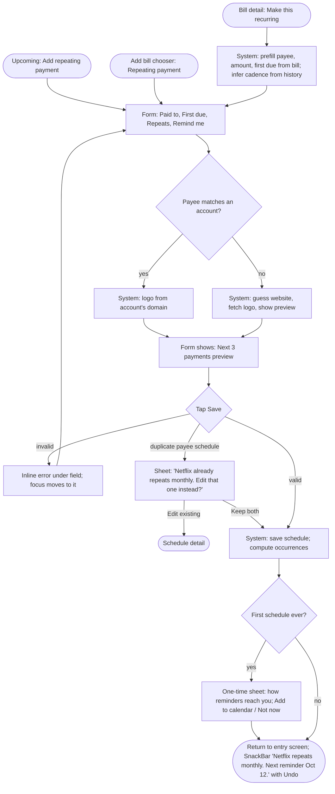
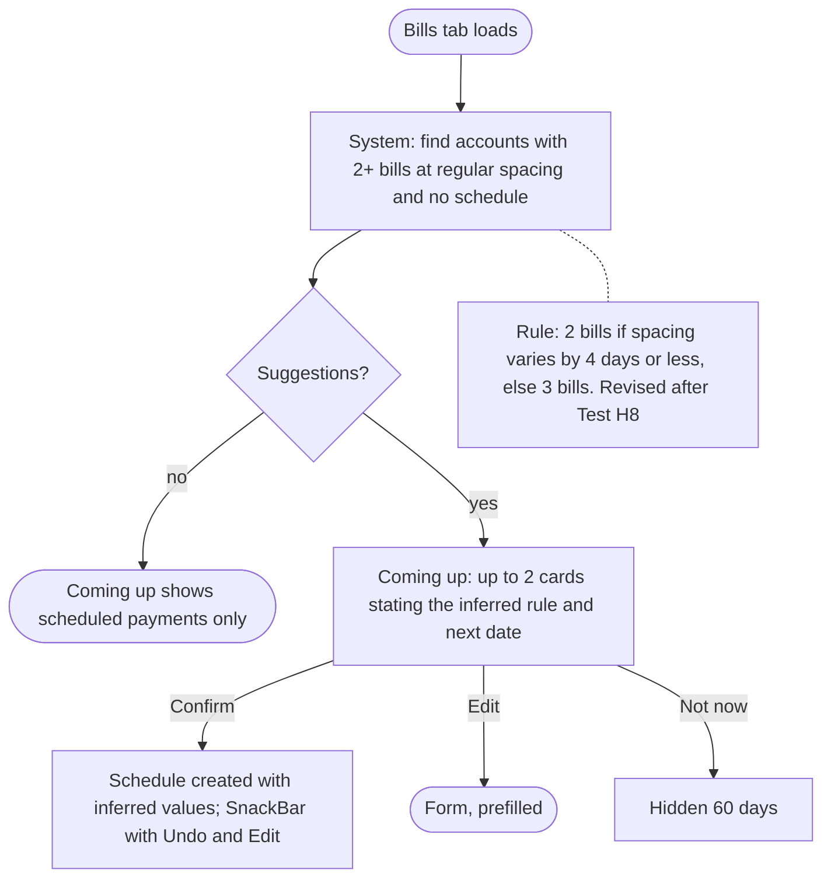
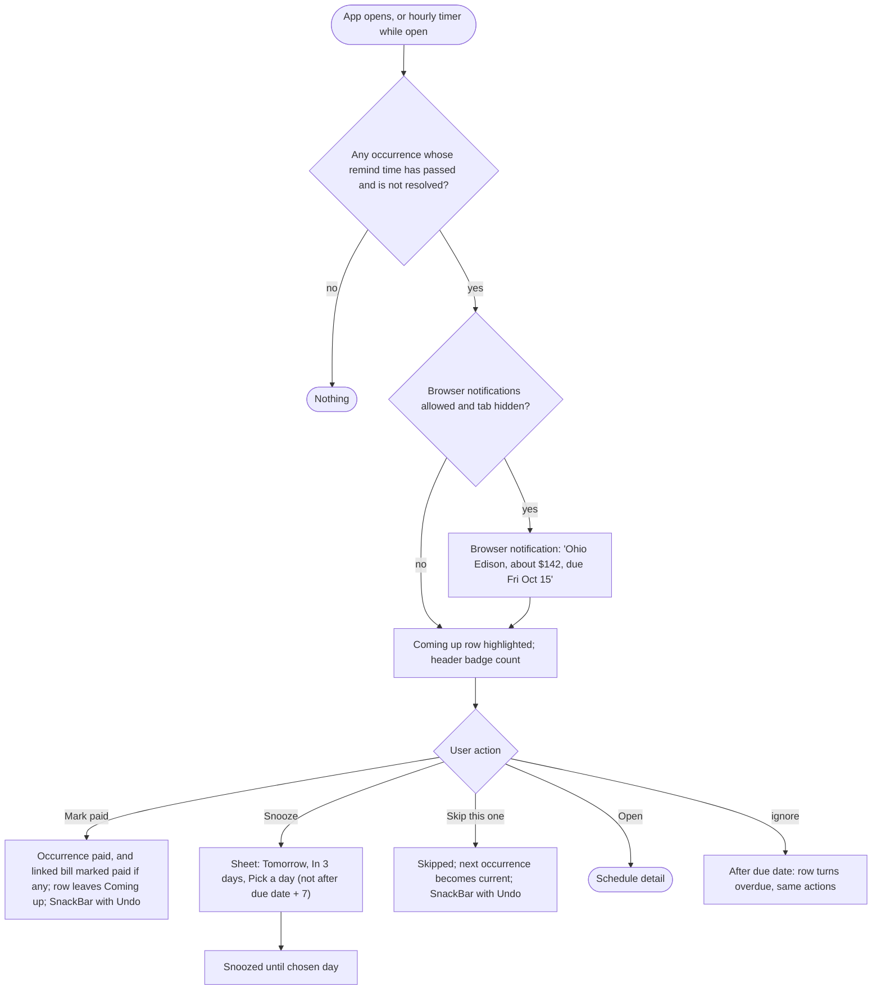
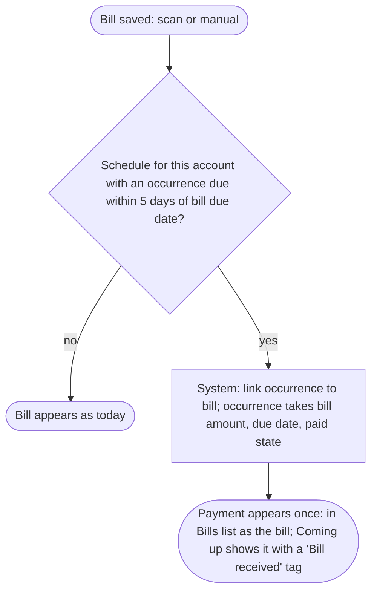

# 04 Prototype: flows, form, states, wireframes, logo component

Skills: `user-flow-diagram`, `form-design`, `state-machine`, `wireframe-spec`, `error-prevention-recovery` (cognitive-accessibility), `component-spec`.

This file specifies the recommended hybrid from 03. Sections marked **[Revised after Test]** were changed by the fix list in 05.

---

## 1. User flows

### 1a. Add a repeating payment (from Upcoming, Add bill, or a bill)



**[Revised after Test: H1]** The one-time explainer reads: "Reminders show in BillSense and as browser notifications while it's open. Add to your calendar to be reminded anywhere." Add to calendar downloads an `.ics` file for this schedule (repeat rule plus an alarm at the lead time).

### 1b. Confirm a suggestion



### 1c. Reminder fires and is resolved



### 1d. A bill arrives for a scheduled payee



### 1e. Edit, pause, delete

From Schedule detail: Edit (same form, prefilled) / Add to calendar (`.ics` download, **[Revised after Test: H1]**) / Pause reminders (occurrences keep computing but do not fire; a banner explains) / Delete repeating payment (confirmation sheet names the payee and says past bills are kept; SnackBar Undo for 10 seconds).

---

## 2. Form spec: Add repeating payment

Single column, top-aligned labels, one screen (not a wizard; four required decisions fit on one compact screen). Route `/schedule/new`, full-screen on compact, centered 560px sheet on wider layouts.

| # | Field | Control | Default | Validation (on blur, and on Save) | Helper / error copy |
| --- | --- | --- | --- | --- | --- |
| 1 | Paid to | Text field with autocomplete from accounts; ProviderLogo at leading edge | Empty, or prefilled from bill | Required, 1 to 60 chars | Error: "Add who you pay, for example Netflix or Landlord." |
| 1a | Website (for logo) | Collapsed link "Logo looks wrong? Change website" under Paid to; expands to a text field | Guessed domain | Optional; must look like a domain; `https://` and `www.` are stripped automatically rather than rejected | Helper: "We use the website to find the logo." Error: "Enter a website like netflix.com." |
| 2 | Amount | Currency field + "Varies" switch | Last bill amount, else empty | Optional; if entered, greater than 0 and under 1,000,000 | Helper: "Leave empty if it changes each time." |
| 3 | First due date | Date picker (never free text) | Prefilled from bill, else empty | Required; not more than 1 year ahead. **[Revised after Test: H2]** A past date only sets the anchor; tracking starts at the next date on or after today | Error: "Pick the next date this payment is due." Past-date helper: "We'll start from Oct 15, the next date after today." |
| 4 | Repeats | **[Revised after Test: H4]** Four chips on one line: Weekly, Monthly, Quarterly, Yearly; "Custom repeat" text button below | Monthly, or inferred | Required | Generated summary directly under the chips: "Every month on the 15th" |
| 4a | Custom | Revealed by "Custom repeat": "Every [N] [weeks / months / years]"; selecting it deselects the chips | N = 2 | N from 1 to 52 | "Every 2 weeks on Friday" |
| 4b | Month end | Shown only when first due is on the 29th to 31st: radio "On the 31st, or the last day in shorter months" / "Always the last day of the month" | First option | n/a | n/a |
| 5 | Remind me | Select: On the day, 1 day before, 3 days before, 1 week before, 2 weeks before, Don't remind | By cadence: weekly on the day, monthly 3 days, quarterly 1 week, yearly 2 weeks; overridden by Settings default if the user set one | Lead time must be shorter than the cadence (no "2 weeks before" on weekly) | Error: "For a weekly payment, pick up to 3 days before." |
| 6 | Ends | Collapsed row "Ends: Never" expands to Never / On date / After N payments | Never | End date after first due; N from 1 to 999 | n/a |
| 7 | Preview | Read-only card "Next payments: Fri Oct 15, Mon Nov 15, Wed Dec 15. First reminder: Tue Oct 12, 9:00" | Computed live | n/a | Shows "Weekend" tag on dates falling on Sat or Sun |
| | Save | Primary button, sticky bottom on compact | Enabled always; validates on tap | | |

Removed on purpose: reminder time of day (Settings only), notes, category picker (inferred), notification channel per payment (global in Settings).

---

## 3. State machines

### Occurrence (one payment in one cycle)

| State | Meaning | UI |
| --- | --- | --- |
| `upcoming` | Due date beyond the remind window | Upcoming screen only, muted |
| `dueSoon` | Inside remind window, before due date | Coming up row, badge counts it |
| `dueToday` | Due date is today | Coming up row, "Due today" accent |
| `overdue` | Past due, unresolved | Coming up row, error accent, stays until resolved |
| `snoozed` | User deferred the reminder | Upcoming only, "Snoozed until Thu" |
| `paid` | Resolved as paid (manually or via linked bill `isPaid`) | Leaves Coming up; history in Schedule detail |
| `skipped` | User chose not to pay this cycle | Leaves Coming up; history shows "Skipped" |

| From | Event | Guard | To | Action |
| --- | --- | --- | --- | --- |
| upcoming | clock reaches due minus lead | schedule not paused | dueSoon | fire reminder (in-app + browser if allowed) |
| upcoming | clock reaches due minus lead | schedule paused | upcoming | none |
| dueSoon | clock reaches due date | | dueToday | fire "due today" once |
| dueToday | clock passes due date | | overdue | none (no repeat notification) |
| dueSoon, dueToday, overdue | Mark paid | | paid | save `paidAt`; set linked bill `isPaid` (**[Revised after Test: H6]**); SnackBar Undo reverts both |
| dueSoon, dueToday, overdue | Snooze(until) | until not after due + 7 days | snoozed | save `snoozedUntil` |
| snoozed | clock reaches `snoozedUntil` | | dueSoon, dueToday, or overdue by date | fire reminder again |
| any unresolved | Skip | | skipped | save override |
| any unresolved | linked bill becomes paid | | paid | none |
| paid, skipped | Undo (within 10 s) | | previous state | delete override |
| paid | Mark unpaid (from history) | | state by date | delete override |

Impossible states prevented: paid and snoozed together; a notification for a paused schedule; two unresolved occurrences shown for one weekly payment beyond the most recent overdue one (older overdue weekly occurrences collapse into "2 missed" on the row); occurrences before the day the schedule was created (H2). The header badge counts schedules needing attention, not occurrences (H9).

### Schedule

`active` to `paused` (Pause) and back (Resume); `active` to `ended` (end rule reached, or Delete); `ended` via Delete can Undo within 10 s back to `active`.

---

## 4. Wireframes

Grey-box only; all type from the theme scale, spacing from `AppTokens`. Compact is under 400pt wide; default is 400pt and above.

### 4a. Bills tab with Coming up (compact)

```
+------------------------------------------+
| Bills                          [Upc 2]   |  <- Upcoming icon, badge = dueSoon+dueToday+overdue
| Ohio Edison is due in 3 days.            |  <- existing status sentence
|                                          |
| COMING UP                     See all >  |  <- section header, link to /upcoming
| +--------------------------------------+ |
| | [logo] Ohio Edison   about $142 [v][:]| |  <- ProviderLogo 40, name, amount; [v] Mark paid, [:] Snooze/Skip/Open
| |        Due Fri, Oct 15, in 3 days    | |
| +--------------------------------------+ |
| | [logo] Netflix       $15.49     [v][:]| |
| |        Due today                     | |
| +--------------------------------------+ |
| | [sug] Spectrum looks monthly         | |  <- suggestion card, max 2
| |       Next about Oct 12. Remind you  | |
| |       3 days before?                 | |
| |       [Confirm]  [Edit]  [Not now]   | |
| +--------------------------------------+ |
|                                          |
| [All] [Utilities] [Subscriptions] ...    |  <- existing BillTypeFilter
| SEPTEMBER 2026                           |
| ...existing bill rows...                 |
+------------------------------------------+
```

Rules: Coming up shows at most 3 rows plus up to 2 suggestions; hidden entirely when there is nothing due in 7 days and no suggestion (no empty box on the main tab). **[Revised after Test: H3]** Every row has the same two trailing 44pt controls: a Mark paid check button and an overflow menu (Snooze, Skip this one, Open). Tapping elsewhere on the row opens Schedule detail. **[Revised after Test: H5]** Estimated amounts read "about $142"; unknown amounts read "Varies".

### 4b. Upcoming screen `/upcoming`

```
+------------------------------------------+
| <  Upcoming                        [ + ] |
| [ Payments ] [ Repeating ]               |  <- segmented control (Revised after Test: H7)
| $412 due in the next 30 days             |  <- sum of known amounts; "+ 2 that vary"
|                                          |
| OVERDUE                                  |
| [logo] Columbia Gas   $88.10   2 days ago|
| THIS WEEK                                |
| [logo] Ohio Edison  about $142  Fri 15   |
| [logo] Netflix         $15.49   Today    |
| NEXT WEEK                                |
| [logo] Gym             $12.00   Tue 20   |
| LATER                                    |
| [logo] Car insurance  $640.00   Mar 1    |
+------------------------------------------+

Repeating segment:
| [logo] Car insurance   Yearly, Mar 1     |  <- all schedules A to Z, tap -> detail
| [logo] Gym             Weekly, Tue       |
| [logo] Netflix         Monthly, 15th     |
| + Add repeating payment                  |
```

Rows in the Payments segment carry the same Mark paid and overflow controls as Coming up (H3).

Default (400pt and above): same single column, max width 720, amounts right-aligned in a fixed column. Empty state: illustration-free card "No repeating payments yet. Add rent, insurance, or subscriptions and we'll remind you before they're due." with a primary "Add repeating payment" button and, if suggestions exist, the suggestion cards below it. Loading: 4 skeleton rows. Error: inline "Couldn't load your payments. Try again" with Retry.

### 4c. Add repeating payment form (compact)

```
+------------------------------------------+
| X  Add repeating payment                 |
|                                          |
| Paid to                                  |
| [logo] [ Netflix                      ]  |
|        Logo looks wrong? Change website  |
|                                          |
| Amount                          Varies o |
| [ $ 15.49                             ]  |
| Leave empty if it changes each time.     |
|                                          |
| First due date                           |
| [ Fri, Oct 15, 2026               cal ]  |
|                                          |
| Repeats                                  |
| [Weekly][Monthly][Quarterly][Yearly]     |  <- one line at 320pt (Revised after Test: H4)
| Every month on the 15th                  |
| Custom repeat                            |  <- text button
|                                          |
| Remind me                                |
| [ 3 days before                     v ]  |
|                                          |
| Ends: Never                          >   |
|                                          |
| +--------------------------------------+ |
| | Next payments                        | |
| | Fri Oct 15 . Mon Nov 15 . Tue Dec 15 | |
| | First reminder Tue Oct 12, 9:00 AM   | |
| +--------------------------------------+ |
|                                          |
| [            Save                     ]  |  <- sticky, full width
+------------------------------------------+
```

### 4d. Schedule detail `/schedule/:id`

Header: ProviderLogo 64, payee name, "Repeats monthly on the 15th", "Reminds you 3 days before". Next payment card with Mark paid / Snooze / Skip. History list (last 12 occurrences: Paid Sep 14, Skipped Aug 15, Paid Jul 13 via bill link). Footer actions: Edit, Add to calendar (**[Revised after Test: H1]**), Pause reminders, Delete repeating payment (destructive colour, confirmation sheet).

### 4e. Bill detail addition

A row under the amount: `[repeat icon] Repeats monthly . View` if a schedule exists; otherwise `[repeat icon] Make this recurring` which opens the prefilled form.

### 4f. Settings > Reminders sheet (replaces the current 3-option picker)

```
Reminders
Default for new repeating payments
( ) Off   ( ) On the day   (o) 1 day before   ( ) 3 days before   ( ) 1 week before
Reminder time          9:00 AM  >
Browser notifications  [ Allow ]   <- triggers permission prompt; shows "Blocked in browser settings" if denied
Only while BillSense is open in a tab. We'll show anything you missed when you come back.
Add all to calendar    [ Download ] <- one .ics with every active schedule (Revised after Test: H1)
To be reminded when BillSense is closed.
```

---

## 5. Error prevention and recovery (cognitive-accessibility lens)

| Risk | Prevention or recovery |
| --- | --- |
| Wrong due date silently breaks every reminder | Preview of the next 3 dates and first reminder, live, above Save; weekend tag on dates |
| Past first due date floods overdue reminders (H2) | Tracking starts today; the past date only sets the anchor, and helper text says which date tracking starts from |
| Reminder never reaches a closed app (H1) | Add to calendar `.ics` export with alarms; one-time explainer on first save |
| 31st in short months | Explicit month-end choice shown only when relevant, never silent clamping |
| Feb 29 yearly | Rule: fall back to Feb 28 in non-leap years; preview shows it |
| Lead time longer than cadence | Invalid options are hidden, not shown-then-errored |
| Duplicate schedule for the same payee | Detected on Save with a choice, not a block |
| Accidental Mark paid, Skip, or Delete | SnackBar Undo for 10 seconds on every resolving action; delete also asks first and states past bills are kept |
| Losing form input | Closing a dirty form asks "Discard this repeating payment?" with Keep editing as the default button |
| Snooze past the point of usefulness | Snooze cannot go beyond due date + 7 days |
| Jargon | Labels use "Repeats", "Remind me", "Paid to"; no "recurrence rule", "RRULE", or "occurrence" in UI |
| Error messages | Every message says what happened and what to do, never "Invalid input" |

---

## 6. Component spec: ProviderLogo

### Overview

Shows the company a payment goes to. Use wherever a payee is listed: Coming up rows, Upcoming list, Schedule detail header, form, and later the existing `BillListRow` (replacing `CategoryTile` there is a follow-up decision, not v1). Do not use for people (use `AvatarInitial`).

### Anatomy

Rounded square tile, same geometry as `CategoryTile` (radius = 0.22 x size) so logos and category tiles align in mixed lists. Contents, in priority order:

1. Logo image on a light surface, inset by 14% padding.
2. Monogram: first letter of the payee on the category colour (`CategoryIcons.colorForKind`), dark glyph, same as `CategoryTile` colouring.
3. Category icon: exactly the current `CategoryTile`, when the name yields no letter (empty or symbols only).

### Props

| Prop | Type | Default | Notes |
| --- | --- | --- | --- |
| `name` | String | required | Payee display name |
| `domain` | String? | null | Explicit website; when null, resolved (see Domain resolution) |
| `serviceType` | String? | null | Passed to `CategoryIcons.kindFor` for fallback colour and icon |
| `size` | double | 46 | 40 compact rows, 46 default rows, 64 detail header, 28 form field |
| `semanticLabel` | String? | "$name logo" | |

### States

`loading` (monogram shown immediately, logo fades in over 150 ms when ready; no spinner), `loaded`, `failed` (monogram stays; no broken-image icon ever), `offline` (same as failed; retried next session).

### Logo source evaluation (probed live on 2026-09-25 from this machine)

| Source | Key needed | Result for netflix.com | CORS header | Works in Flutter web CanvasKit | Verdict |
| --- | --- | --- | --- | --- | --- |
| unavatar.io/{domain}?fallback=false | No | 200 PNG; 404 for an unknown domain | `access-control-allow-origin: *` | Yes | **Primary.** Keyless, proper 404 for misses, 28-day cache header. Favicon-grade quality |
| img.logo.dev/{domain}?token= | Publishable token (free tier) | 401 without token | `*` | Yes | **Optional upgrade** when `LOGO_DEV_TOKEN` is set; true brand logos |
| google.com/s2/favicons?domain=&sz=128 | No | 200 PNG | none | Only with HTML-element fallback | Not used directly (unavatar already proxies it with CORS) |
| icons.duckduckgo.com/ip3/{domain}.ico | No | 200 ICO | none | Only with HTML-element fallback | Not used |
| cdn.brandfetch.io/{domain} | Client ID | 200 HTML page without an ID | `*` | No (not an image without ID) | Not used in v1 |
| logo.clearbit.com/{domain} | n/a | No response (connection failed) | n/a | No | Dead; do not use |

Flutter web note: the CanvasKit renderer downloads image bytes with a network request, so a source without a CORS header fails silently. Both chosen sources send `access-control-allow-origin: *`. Keep `Image.network`'s default web strategy; do not enable the HTML-element fallback in lists, because each fallback image becomes a platform view, which is expensive when scrolling.

Rate and privacy: unavatar's anonymous use is rate-limited per IP (check current limits at implementation), so results are cached (below). The only data sent to a third party is the payee's website domain, never the user's name, amount, or account number.

### Domain resolution

1. Explicit `domain` prop (from the user's "Change website" field or stored on the payee).
2. Curated map for known providers, shipped in code and seeded for the demo data: Ohio Edison to firstenergycorp.com, Columbia Gas to columbiagasohio.com, Spectrum Internet to spectrum.com, Verizon Wireless to verizon.com, Netflix to netflix.com. City Water Dept has no entry and shows its monogram, which is correct behaviour worth demoing.
3. Guess: lowercase the name, drop trailing generic words (Inc, LLC, Co, Internet, Wireless, Energy, Dept, Bill, Payment), remove spaces and punctuation, append ".com". Only used when the result is 3 or more letters. The form shows the guessed logo, so a wrong guess is visible and correctable at setup.
4. No domain: monogram.

### Caching

In memory for the session: domain to bytes or to "failed". Persisted in `shared_preferences`: domain to "failed" with a timestamp, so known misses are not re-requested for 7 days. Successful images rely on the HTTP cache (28 days observed from unavatar).

### Accessibility

Decorative when the payee name is rendered next to it (exclude from semantics); labelled "$name logo" when shown alone (Schedule detail header on narrow widths). Monogram glyph contrast meets 4.5:1 on every category colour because it reuses the `CategoryTile` dark glyph.

### Usage rules

- Do: always pair with the payee name in lists.
- Do: show the monogram immediately; never delay layout waiting for a network logo.
- Don't: tint or recolour logos; don't place logos directly on the dark surface (many favicons are dark glyphs on transparent backgrounds), always on the light inset tile.
- Don't: use a logo as the only indicator of state (paid, overdue).

## Stage check-in

Produced: five flows, the form spec, occurrence and schedule state machines, six wireframes with empty, loading, and error states, an error-prevention table, and the ProviderLogo spec with a live-verified API choice (unavatar primary, Logo.dev optional, Clearbit dead). Next: Test runs an expert heuristic pass and a cognitive load map over these, then applies fixes here. One plan-relevant finding: Flutter web's CORS requirement rules out the two keyless favicon endpoints named in the plan unless proxied, which is why unavatar was added.
