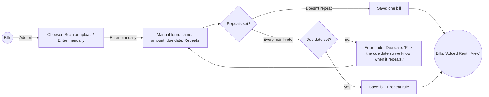
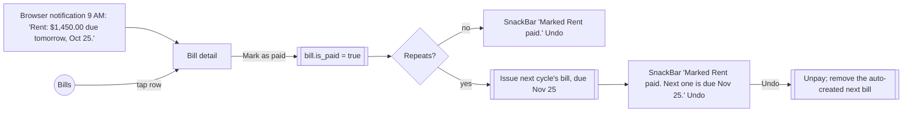

# 07 Redesign: fold repeating payments into the existing bill journey

Supersedes the surfaces in 04 and 06. The first build added a second object ("repeating payment") with its own screens beside the bill journey. This document starts again from the journey the app already has.

Evidence used: the app as committed at `f6a97a3` (before the reminders build), `Intial Document/design-system-and-product.md`, and `Intial Document/product-requirements.md`. No user sessions.

---

## Stage 1. Empathize: journey map (`journey-map`)

**Persona:** Dana Whitfield, the primary market. She has five accounts, uses the app five times a month for under two minutes each, is "triggered by a bill notification", and "never browses". Constraint lenses: Rafael (urgency reads as a scam) and Marguerite ("tell me if I'm alright").

**Scenario:** a bill is due. Dana wants to know the amount and the day, pay it, and stop thinking about it. She also has rent and car insurance, which never arrive as a document.

### As-is journey (before the reminders build)

| Stage | Goal | Touchpoint | Emotion | Pain point | Opportunity |
| --- | --- | --- | --- | --- | --- |
| 1. Trigger | Notice something is due | Nothing (Settings > Reminders existed but did not fire) | Neutral to anxious | She finds out from the late fee | Make the existing Reminders setting actually remind |
| 2. Check | "Am I alright?" | Bills tab: status line ("Ohio Edison is due on Sep 27"), then the list with the current cycle at the top ("Due in 2d") | Reassured | None; this works | Keep it exactly as it is |
| 3. Add | Get a bill in | Add bill → Scan or upload / Enter manually → back to Bills with "Added X · View" | Confident | Rent and insurance must be re-typed every cycle | Let a manually entered bill repeat |
| 4. Understand | Is this normal? | Bill detail: amount, due date, one sentence | Informed | None | Keep it |
| 5. Pay | Pay and close the loop | Nothing. There is no way to mark a bill paid; only seeded history shows "Paid" | Unresolved | The bill stays "due" after she paid it | Add "Mark as paid" where the bill already is |
| 6. Next cycle | Not have to remember | Nothing | Forgets | She must remember rent and insurance herself | Next cycle appears by itself for repeating bills |

**Emotional curve:** Check (+2) and Understand (+2) are high. Trigger (−1), Pay (−1) and Next cycle (−2) are the low points. The feature belongs in those three gaps, not in Check and Add, which already work.

**Moments of truth:** "I paid it, and the app agrees" (Pay), and "I didn't have to remember" (Next cycle).

### What the first build did to this journey

| Stage | What was added | Effect |
| --- | --- | --- |
| Check | "Coming up" card with 3 rows, 2 suggestion cards, and an Upcoming icon with a red count badge | The same Ohio Edison bill appeared three times: status line, Coming up, and list row, each with different controls. The bill list dropped below the fold. The red badge and red "Overdue" broke D2 (words, never colour, for status). |
| Add | A third chooser card, "Repeating payment" | The chooser's question changed from *how* do I get this bill in to *what* am I adding. That's a second noun behind the primary button. |
| Add | A 7-field schedule form (payee, website, amount, first due, repeats, remind me, ends) plus a preview | The manual bill form is 3 fields. The same payment now had two forms. |
| Understand | "Make this recurring" link on every bill | Fine in intent, but it pointed into the second system |
| New | Upcoming screen, Schedule detail screen | New destinations. The product rule is "Home plus persistent Add; a separate section is a place you have to remember to visit, and Dana never will." |
| Settings | 3-option picker became a 5-control sheet | Broke "Settings is four items and stays four" in spirit |
| Pay | Mark paid existed, but only on Coming up and Upcoming rows | The payment step lived outside the bill it paid |

**Top opportunities, by impact and feasibility:**
1. Put "Mark as paid" on the bill detail screen. It closes the Pay gap, which the old journey never had.
2. Let a manually entered bill repeat, and create the next cycle's bill automatically. This closes Next cycle.
3. Make the existing Settings > Reminders fire, at a fixed, calm time. This closes Trigger.
4. Remove everything added to Check and Add.
5. Show company logos on the existing bill rows (the original request), falling back to today's category tile.

**Stage check-in:** the journey shows the feature was placed in the two stages that already worked (Check and Add) and skipped the three that didn't (Trigger, Pay, Next cycle). That confirms the plan; Define now decides the object model.

---

## Stage 2. Define

### Object model (`information-architecture`)

**Content audit:** the app has one noun, *Bill* (provider, amount, due date, paid, one sentence), grouped by *Account*. The first build added *Payee*, *Schedule*, *Occurrence*, *Override* and *Suggestion*. Four of those are visible in the UI.

**Decision:** there is one noun, **Bill**, and "repeats" is an attribute of a bill.

| Concept | Before | After |
| --- | --- | --- |
| Bill | Bill | Bill (unchanged) |
| Repeating payment | Separate object with its own form, detail and list | A bill whose **Repeats** field is set. Internally a repeat rule on the bill's account |
| Occurrence | Computed rows in Coming up and Upcoming | Each cycle is a **real bill** in the normal list, created when the previous one is paid, or when its date arrives if it's still unpaid |
| Payee | Separate object with a website field | Gone. The bill's provider name is the payee |
| Suggestion | Cards on the Bills tab | Gone. Scanned utilities already repeat because a new bill arrives each month, so there is nothing to suggest |
| Snooze / Skip | Row menu | Gone. Deleting this cycle's bill skips it, because the next cycle still comes |
| Reminder settings | Per-schedule lead time plus a 5-control sheet | The existing Settings > Reminders: Off / Day before / Day of, at 9 AM |

### Sitemap after (matches the product doc's sitemap)

```
BILLS (home)
├── Status line          unchanged; repeating bills count like any bill
├── Type filter          unchanged
├── Bill rows            unchanged, plus company logo when one exists
└── Add bill             unchanged: Scan or upload / Enter manually
     └── Enter manually  + one optional field: Repeats

BILL DETAIL              amount, due date, [Mark as paid], one sentence
├── "Repeats every month" line, only on repeating bills
└── ⋮ Edit · Add to calendar (repeating only) · Delete

SETTINGS                 four items, unchanged
└── Reminders            Off / Day before / Day of, now actually notifies
```

Removed: `/upcoming`, `/schedule/new`, `/schedule/:id`, `/schedule/:id/edit`, the Coming up section, the badge, suggestion cards, and the third Add bill card.

**Findability:** every task is at most 3 taps from Bills. Add a repeating bill: Add bill → Enter manually → Save. Mark paid: row → Mark as paid.

### Principles for this feature (`design-principles`), in priority order

1. **One bill, one row.** Anything payable appears exactly once on the Bills tab. *Counter-example:* the Coming up card duplicating list rows. *Trade-off:* no "at a glance" summary beyond the status line.
2. **Add bill asks how, never what.** The chooser only offers ways to get a bill in. New kinds of thing are fields on the bill, not new cards. *Counter-example:* the "Repeating payment" card.
3. **Pay where the bill is.** Resolving a bill happens on that bill, not in a separate hub. *Counter-example:* Mark paid only on Coming up rows.
4. **Reminders are quiet and global.** One setting, fixed time, words not colour, no count badges (D2, US-015). *Counter-example:* the red badge and per-payment lead times.
5. **The product carries the calendar.** The user states the due date and how often; the app works out every date after that, including short months and leap years (Tesler).

---

## Stage 3. Ideate (`jakobs-law`, `teslers-law`, `concept-selection`)

**Conventions to keep (Jakob's Law):** in this app, a bill is created through Add bill, appears as a row, and is resolved on its detail page. Users of bill apps (Copilot, WalletHub, TimelyBills in the PRD's competitor list) expect "repeats" to be a field on the entry form, like calendar apps' "Repeat: Never / Weekly / Monthly". Nobody expects a separate schedule object.

**Complexity placement (Tesler's Law):**

| Complexity | Who carries it |
| --- | --- |
| How often it repeats | User: one field, 5 plain options |
| Every future date, the 31st in short months, Feb 29 | Product |
| When the next bill appears | Product: the next cycle is created once the current one is paid, or when its due date arrives |
| How far ahead to remind | Product: one global choice in Settings |
| End dates, custom intervals, per-bill lead times | Removed. To stop, set Repeats to "Doesn't repeat" or delete |
| Finding a logo | Product, from a curated list. Unknown names keep today's category tile; no website field |

### Criteria, fixed before comparing

| # | Criterion | Type |
| --- | --- | --- |
| C1 | Each payable thing appears once on the Bills tab | Threshold |
| C2 | No new destination: no screen, tab or icon | Threshold |
| C3 | The Add bill chooser is unchanged | Threshold |
| C4 | No colour or count badge carries status (D2) | Threshold |
| C5 | Supports rent and insurance (no document) | Threshold |
| C6 | Mark paid works for every bill, scanned or manual | Trade-off |
| C7 | Reuses existing screens and components | Trade-off |
| C8 | Build cost | Trade-off |

### Concepts

**A. Repeats is a field on the bill (chosen).** Enter manually gains an optional Repeats field. Each cycle is a real bill in the normal list, created automatically. Mark as paid lives on bill detail, and Settings > Reminders fires.
- Passes C1–C5.
- C6: yes. C7: highest, because detail, edit, delete, history, the status line and the filter all work for repeating bills for free.
- C8: medium. It needs a small engine that issues the next bill.

**B. Upcoming as a filter chip.** Keep schedules as a separate object, and show their occurrences through an "Upcoming" chip in the existing type filter.
- Fails C1: with "All" selected, an occurrence and its bill both show.
- Keeps two nouns.

**C. Trim the first build.** Keep Coming up, but de-duplicate it against the list, drop the badge, and move the Repeating card into the manual form.
- Fails C2: Upcoming and Schedule detail remain.
- Fails C1 in spirit: Coming up is a second list of the same bills.

**Decision: A.**

**What A costs:**
- There's no single "all my upcoming payments" screen. The Bills list, newest first, is that view, and the status line says what matters.
- Per-bill reminder timing, custom intervals and end dates are gone.
- Scanned utility bills can't be set to repeat, because the next real bill replaces the prediction.

**Revisit if** users with more than about 10 repeating payments can't find the next one in the list, or ask for different lead times per bill.

**Rejected concepts:**
- B was testing whether "upcoming" is a view of the list. It lost on C1. It comes back if a single filter chip "Due soon" is wanted later, as a filter over real bills, not as a separate object.
- C was testing whether the first build could be saved. It lost on C2. Nothing brings it back.

---

## Stage 4. Prototype

### Flows (`user-flow-diagram`)

**Flow 1: add a repeating bill (rent)**



**Flow 2: pay, and the next cycle appears**



**Flow 3: skip or stop.**
- Skip one cycle: delete that bill (existing swipe or detail menu, with Undo). The engine issues the following cycle.
- Stop repeating: Edit, then set Repeats to "Doesn't repeat". Existing bills stay; no more are created.

**Engine rules** (system process, invisible to the user):
- For each repeat rule, keep **at most one unpaid bill**. If more than one exists (for example after an Undo), remove the later auto-created ones.
- When there's **no unpaid bill**, create the next cycle after the latest cycle issued, including deleted ones so a deletion skips rather than re-creates. If several cycles were missed, issue only the most recent one, so a long absence doesn't produce a pile of overdue bills.
- The first cycle is the bill the user saved. No cycles are created before it.

### Form spec (`form-design`): Enter manually, with one added field

Single column, labels on top, same as today. Order: Bill name or provider → Amount → Due date → **Repeats** → Save.

| Field | Control | Default | Validation | Copy |
| --- | --- | --- | --- | --- |
| Repeats | Select with 6 options: Doesn't repeat, Every week, Every month, Every 3 months, Every year, Custom. Custom reveals a number field "Repeat every [__] days" (whole days, 1–365) | Doesn't repeat | When not "Doesn't repeat", the due date becomes required | Label "Repeats". Error under Due date: "Pick the due date so we know when it repeats." Helper under Repeats when set: "Next: Nov 25, then Dec 25." |

- A select rather than radios: 5 options is at the radio threshold, but a select keeps the form's existing 3-field height, and the default "Doesn't repeat" is right for most entries.
- The field is not shown when editing a scanned bill from a real account, because those repeat by arriving.
- In edit mode it shows the bill's current rule. Changing it re-anchors the rule on this bill's due date; "Doesn't repeat" removes the rule.
- Custom intervals are counted in days only (added on request). Weeks and months stay as presets, so "every 2 weeks" is entered as 14 days. There's no website, reminder or end field. The Save button, the saving state and the offline note are unchanged.

### Bill detail wireframe (the answer screen, compact)

```
+------------------------------------------+
| <  Rent                              [:] |   [:] Edit · Add to calendar · Delete
|                                          |
|   $1,450.00                              |   amount stays the largest element
|   Due Oct 25                             |
|   Repeats every month                    |   only on repeating bills
|   [ Mark as paid ]                       |   secondary (outline) button, 60pt
|   ------------------------------------   |
|   Same amount as last time. Added for you. |  the one sentence
+------------------------------------------+
Paid state:  "Paid."  plus a text button "Mark as unpaid"
```

### Bills tab

Identical to the committed app: title, status line, filter, rows. The only change is that the row tile shows the company logo on a light tile when one is known, and today's category tile otherwise.

**Stage check-in:** flows, form and wireframe are defined, with no new screens. Test next, against the heuristics and the Bills tab's density.

---

## Stage 5. Test

### Heuristic evaluation (`heuristic-evaluation`, one evaluator)

| # | Heuristic | Finding | Sev | Fix applied |
| --- | --- | --- | --- | --- |
| T1 | Visibility of status | After Mark as paid on a repeating bill, the new next bill appears without explanation | 2 | SnackBar names the next date: "Next one is due Nov 25." |
| T2 | User control | Undo of Mark as paid must also remove the auto-created next bill, or the list gains a duplicate | 3 | Engine rule: at most one unpaid bill per rule |
| T3 | Error prevention | Repeats without a due date has no anchor | 3 | Due date becomes required, with an inline error that names the fix |
| T4 | Consistency | "Mark paid" copy in the first build versus "Paid" labels in rows | 1 | Use "Mark as paid" / "Paid" consistently |
| T5 | Match real world | "Every 3 months" vs "Quarterly": the PRD personas speak plainly | 1 | Use "Every 3 months" |
| T6 | Minimalism | Reminder time was a separate control | 2 | Fixed at 9 AM and stated in the option description |
| T7 | Error recovery | Deleting a repeating bill might read as "stop repeating" | 2 | Delete SnackBar on a repeating bill says "Deleted Rent for Oct 25. Next one is due Nov 25." To stop, Edit and set Repeats to "Doesn't repeat" |
| T8 | Status visibility (D2) | The existing `BillListRow` colours "overdue" red, which predates this work | 2 | Out of scope: noted, not changed |
| T10 | Minimalism (found in build QA) | Auto-added bills said "Repeats every month" in the sentence, right under the "Repeats every month" line | 1 | Sentence is now "Same amount as last time. Added for you." |
| T9 | Help | Browser notifications only fire while a tab is open | 2 | The Reminders option description says "while BillSense is open in your browser". The bill detail menu offers "Add to calendar" for repeating bills |

### Density (`critique-information-density`), Bills tab at 360pt

- **Cognitive load: pass.** Four items (status line, filter, rows, Add), within the 5-item content hierarchy in the product doc. The first build had seven.
- **Content priority: pass.** The status line leads again, and the first bill row is above the fold on a 360×740 viewport.
- **Scanning pattern: pass.** One list, one row shape, date column on the left.
- **Progressive disclosure: pass.** Repeat details live in the bill detail, one tap away.

**Stage check-in:** two severity-3 findings (T2, T3), both fixed in the spec. Nothing changes the plan.

---

## Stage 6. Deliver: handoff (`handoff-spec`)

### Remove (first-build files and wiring)

- `features/reminders/upcoming_screen.dart`, `schedule_form_screen.dart`, `schedule_detail_screen.dart`, `widgets/coming_up_section.dart`, `widgets/suggestion_card.dart`, `reminder_actions.dart`
- `shared/components/payment_row.dart`, `features/settings/reminders_sheet.dart`, `shared/logic/schedule_suggestions.dart`
- The `/upcoming` and `/schedule/*` routes
- Coming up and the badge in `home_screen.dart`; the third card in `add_bill_screen.dart`; `_RepeatsRow` in `bill_detail_screen.dart`
- The `settings_state.dart` migration and new keys: back to the single `reminders` key

### Keep and reshape

- `shared/logic/recurrence.dart` (tested date maths) and `shared/logic/ics_export.dart`, both adapted to the slimmer model.
- `shared/models/reminder_models.dart` becomes `RepeatRule`: id, accountId, name, serviceType, unit, interval, anchorDate, amount, lastIssued.
- `state/reminder_store.dart` becomes the **RecurringBills** engine. It holds repeat rules, issues bills through `BillRepository.createBill`, applies the engine rules above, and runs the 9 AM reminder check.
- `shared/components/provider_logo.dart`, with a fallback to `CategoryTile` instead of a monogram.
- `shared/platform/browser_bridge*`.

### Change

| File | Change |
| --- | --- |
| `manual_bill_screen.dart` | Repeats select, due-date requirement, next-dates helper; create or update the rule on save; repeating bills get `account_id = rep-{ruleId}` |
| `bill_detail_screen.dart` | "Repeats every month" line; Mark as paid / Mark as unpaid with Undo; Add to calendar in the menu; delete SnackBar copy for repeating bills |
| `bill_list_row.dart` | `ProviderLogo` in place of `CategoryTile` (same size, same radius) |
| `settings_screen.dart` | Original picker. Descriptions become "Notify at 9 AM the day before each due date, while BillSense is open in your browser." Choosing On asks for browser permission |
| `fake_bill_repository.dart` | `_applyEdits` honours `is_paid` and `account_id` |

**Tokens:** existing ones only, with no new colours. The Mark as paid button is `AppButton.secondary`, which is 60pt tall.

**Copy:**

| Where | String |
| --- | --- |
| Repeats options | Doesn't repeat / Every week / Every month / Every 3 months / Every year / Custom |
| Custom days error | Enter a number of days from 1 to 365. |
| Custom detail line | Repeats every 21 days ("every day" for 1) |
| Repeats helper | Next: {MMM d}, then {MMM d}. |
| Due date error | Pick the due date so we know when it repeats. |
| Detail line | Repeats every month (week / 3 months / year) |
| Mark paid SnackBar | Marked {name} paid. · Marked {name} paid. Next one is due {MMM d}. · Undo |
| Paid state | Paid. · Mark as unpaid |
| Auto bill sentence | Same amount as last time. Added for you. |
| Notification | {name}: {amount} due tomorrow, {MMM d}. / {name}: {amount} due today. |

**Seed demo data:** two repeating manual bills, **Rent** ($1,450, monthly, due in 3 days) and **Car insurance** ($640, yearly, due in 10 days), so the flows can be tried immediately. No suggestions and no schedules on scanned accounts.

### QA checklist (`design-qa-checklist`), checked on localhost:3012

Verified in the browser: ✅. Covered by unit tests: 🧪. Not exercised: ⬜ (the browser harness can't type into Flutter text fields, so a new repeating bill couldn't be saved end to end).

- ✅ Bills tab shows title, status line, filter, rows, and Add bill, and nothing else
- ✅ Each payable thing appears once; Rent appears once per cycle, in its month group
- ✅ The Add bill chooser shows exactly two cards
- ✅ No count badge, and no new colour for status (the pre-existing red "overdue" is T8, out of scope)
- ✅ Enter manually shows Repeats, defaulting to "Doesn't repeat"
- ✅ Repeats without a due date shows "Pick the due date so we know when it repeats." under Due date, and the prompt drops "(optional)"
- ✅ Mark as paid on Rent adds exactly one next bill (Oct 28), and Undo unpays Rent and removes it (count 75 → 76 → 75)
- ✅ Deleting a cycle skips it: deleting Oct 28 issued Nov 28, with the SnackBar "Deleted Rent for Oct 28. Next one is due Nov 28."
- ✅ The bill detail menu shows Edit · Add to calendar · Delete on a repeating bill
- 🧪 Monthly on the 31st lands on the 28th or 30th in short months; Feb 29 yearly lands on Feb 28; RRULE and alarm triggers
- ✅ Logos show for known providers on a light tile; City Water Dept keeps the category tile
- ✅ Mark as paid is a 60pt secondary button, 2 taps from Bills
- ⬜ Saving a new repeating bill, the "Next: …, then …" helper, and "Doesn't repeat" on edit (logic reviewed, not clicked through)
- ⬜ A browser notification firing at 9 AM (needs a real day boundary; the permission request is on the Settings tap)
